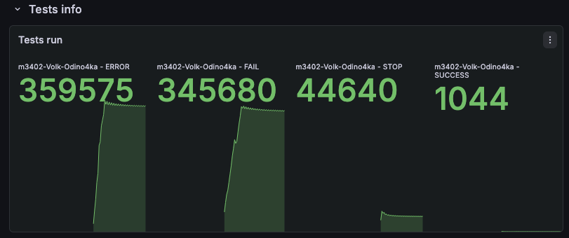

# Условия теста
```json
{
    "ratePerSecond": 4000,
    "testCount": 1500000,
    "processingTimeMillis": 1000
}
```
---
```json
{
    "Аккаунт": "acc-13",
    "parallelRequests": 2000, 
    "rateLimitPerSec": 5000,
    "averageProcessingTime": "PT0.01S"
}
```

## Изначальные условия и анализ

Все тесты пофейлились или упали с ошибкой, много ошибок связанных с request timeout.

## Решение
Попробовал перевести базу данных да асинхронное взаимодействие - но это не помогло, все равно было куча ошибок

Попробовал убрать взаимодейстие с базой (отправка событий), и без нее все тесты прошли


