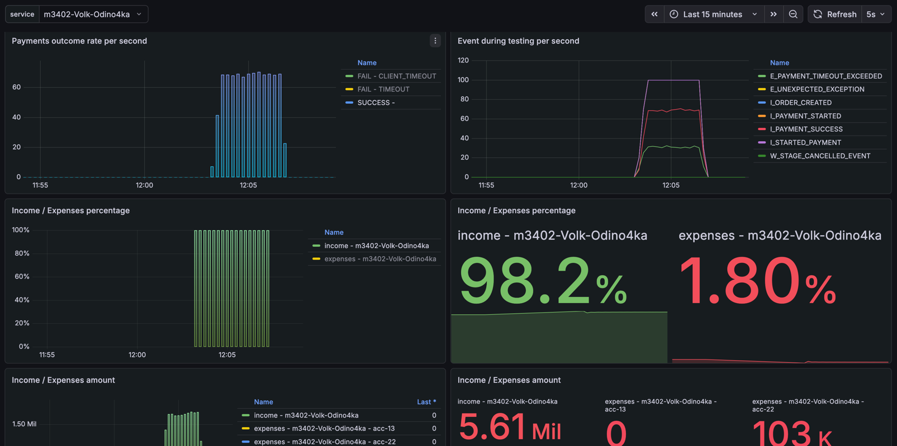
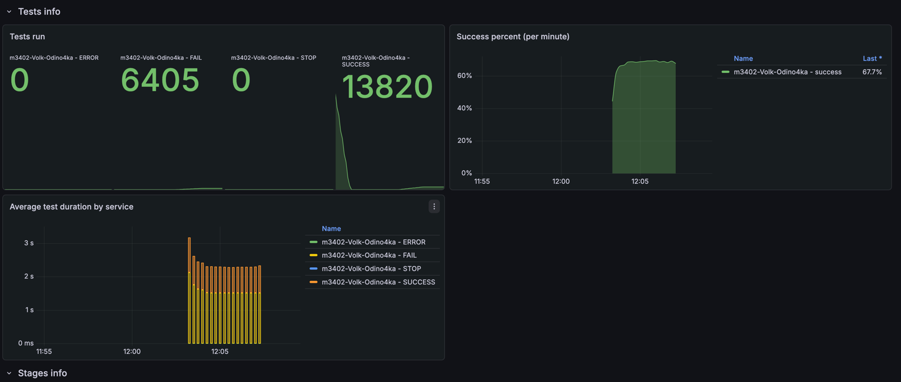
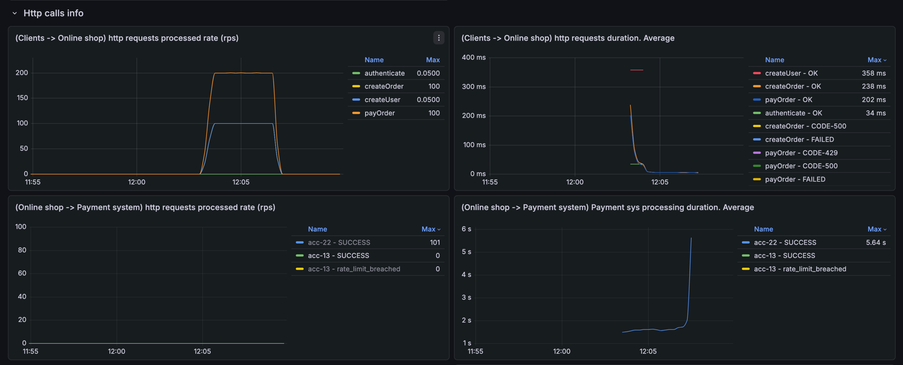
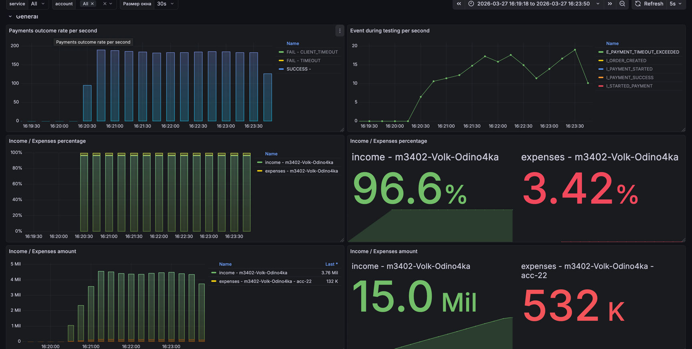
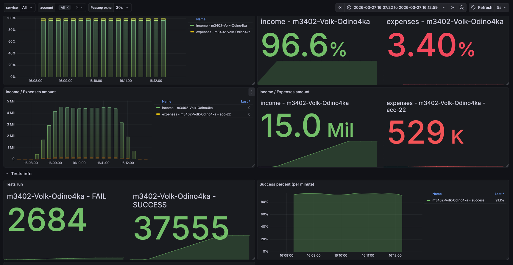

# Условия теста
```json
{
    "ratePerSecond": 100,
    "testCount": 20000,
    "processingTimeMillis": 1500
}
```
---
```json
{
    "Аккаунт": "acc-22",
    "parallelRequests": 20000, 
    "rateLimitPerSec": 1100,
    "averageProcessingTime": "PT1.6S"
}
```

## Изначальные условия и анализ



Изначально видим, что не все тесты проходят успешно - из-за того что некоторые запросы выполняются дольше чем клиент готов ждать

## Решение
Добавляю hedged requests, после игры с параметрами лучший результат, что получилось достичь




