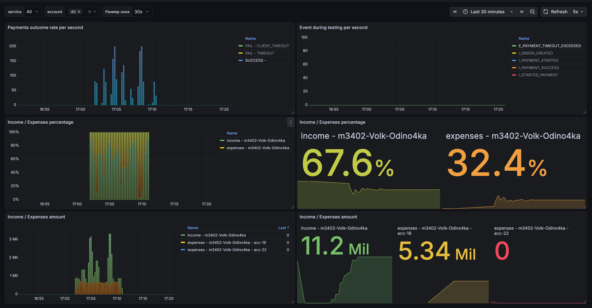
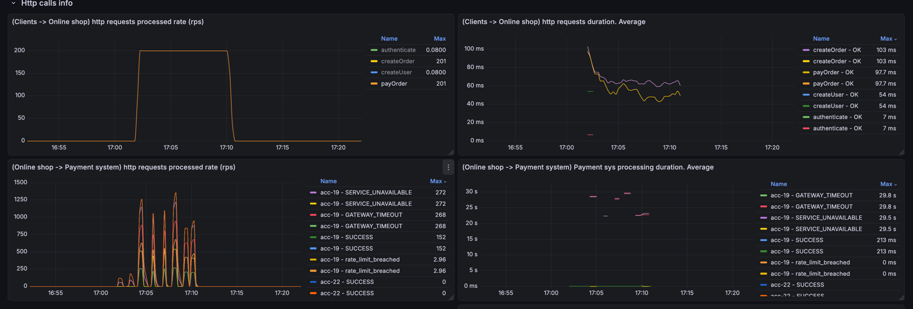
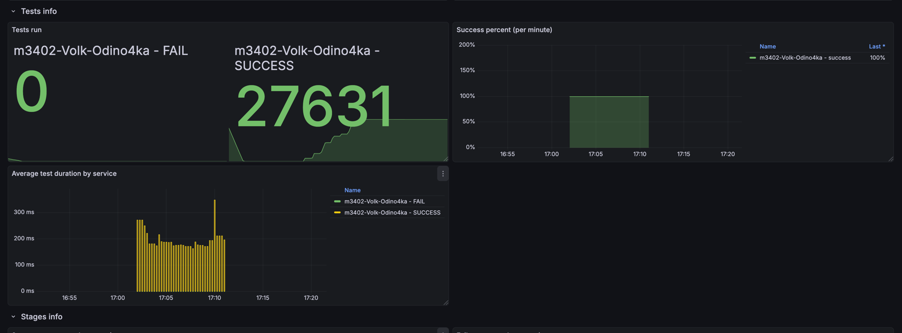
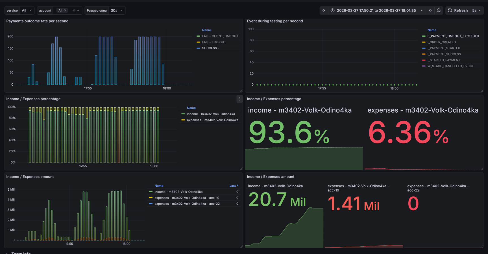
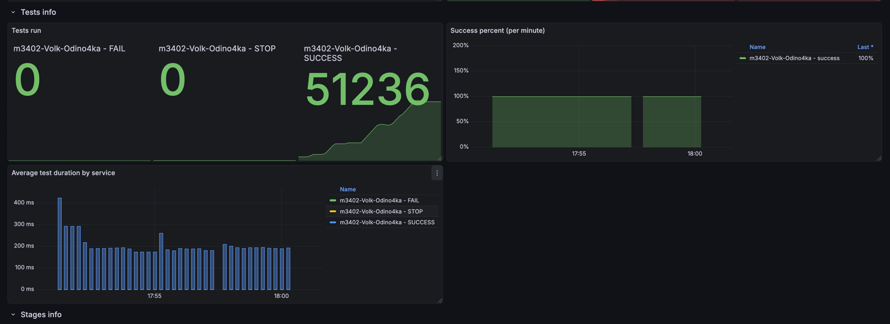

# Условия теста
```json
{
    "ratePerSecond": 100,
    "testCount": 50000,
    "processingTimeMillis": 10000000
}
```
---
```json
{
    "Аккаунт": "acc-19",
    "parallelRequests": 20000, 
    "rateLimitPerSec": 200,
    "averageProcessingTime": "PT0.1S"
}
```

## Изначальные условия и анализ



Видим что сервер ведет себя неадекватно, имеет интервалы недоступности, из-за этого мы имеем убытки

Решением будет добавить Circuit Breaker

## Решение



Добавил Circuit Breaker с трешолдами по 10% для неуспешных вызовов и 10% для медленных вызовов


