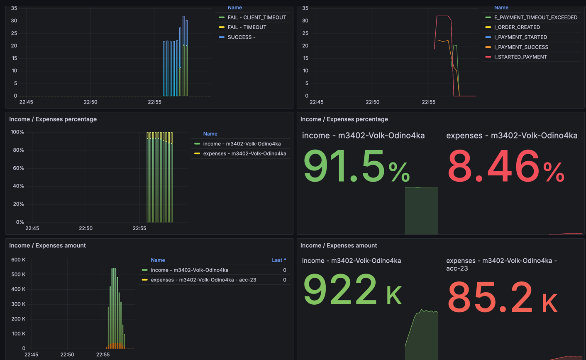
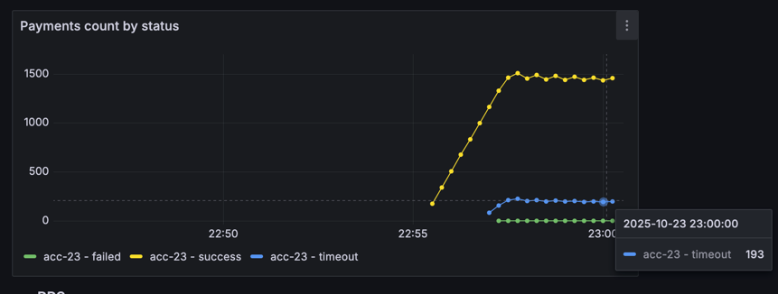
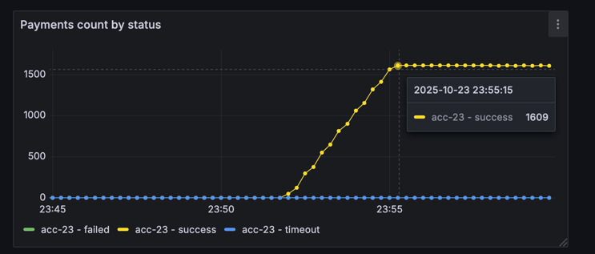
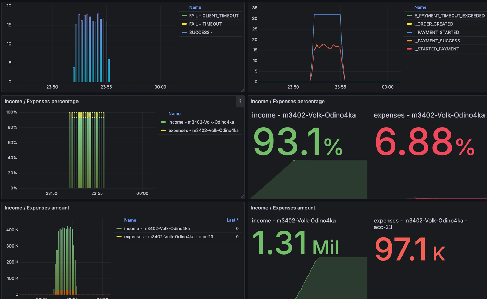
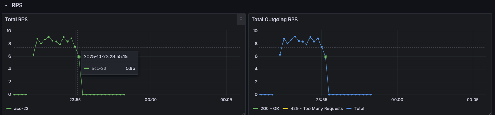

## Условия тестов
```json
{
  "Аккаунт": "acc-23",
  "ratePerSecond": 16,
  "testCount": 1600,
  "processingTimeMillis": 30000
}
```
Аккаунт:
- accountName=acc-23
- parallelRequests=64 
- rateLimitPerSec=11 
- price=30,
- averageProcessingTime=PT1S 
- enabled=true

## Изначальное состояние



Как видим некоторое количество запросов падает по таймауту, видимо потому, что и условия входящий `rps = 16`, а 
внешняя система может держать `11`

Максимально внешний сервис может держать нагрузку
`1/averageProcessingTime * parallelRequests = 1/1 * 64 = 64rps`
Но ограничивает rateLimit до 11rps, что меньше 16rps, c которыми мы в него ходим

Решил также ограничить входящий RPS до 11, отдавая наружу ошибку 429

## Результат
После установки RateLimiter'а все запросы прошли успешно



Ну и по графику видно, что RateLimiter работает и входящий rps не поднимался больше 11



