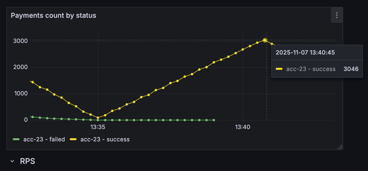
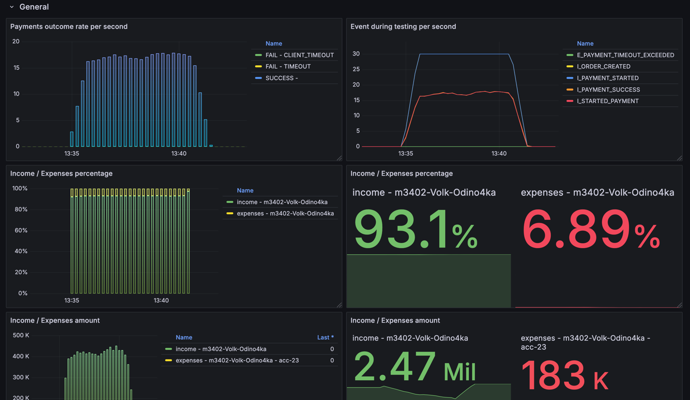

# Условия теста
```json
{
  "ratePerSecond": 15,
  "testCount": 3000,
  "processingTimeMillis": 2500
}
```
---
```json
{
  "Аккаунт": "acc-23",
  "parallelRequests": 64, 
  "rateLimitPerSec": 11,
  "averageProcessingTime": "PT1S"
}
```

## Изначальные условия


Как видим, все платежи (3000 как указано в условии теста) завершились с успехом

## Решение
Изначально тест уже проходит, видимо из-за добавленного в прошлой работе RateLimiter на входящие запросы.


Но замечаю недостаток - почему-то по графикам наблюдаю реальный OK RPS равный всего 8, вместо ожидаемых 11. 
Кажется что этот недостаток из-за особенности работы SlidingWindowRateLimiter
