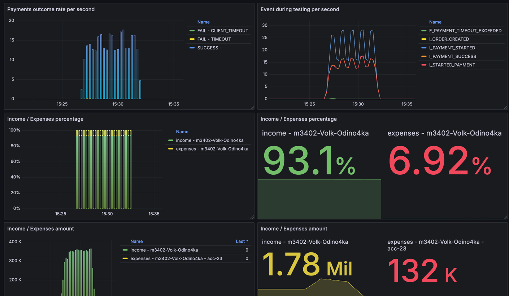
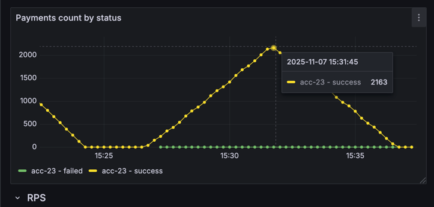
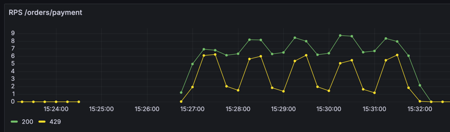
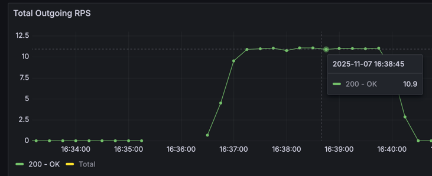
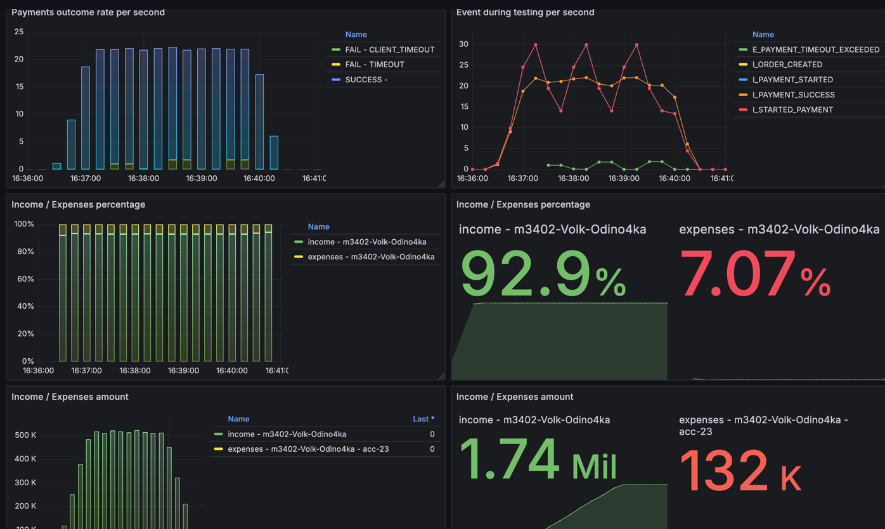

# Условия теста
```json
{
  "ratePerSecond": 11,
  "testCount": 2200,
  "processingTimeMillis": 13000,
  "profile": "s_0.7_60"
}
```
---
```json
{
  "Аккаунт": "acc-23",
  "parallelRequests": 64, 
  "rateLimitPerSec": 11,
  "averageProcessingTime": "PT1S"
}
```

## Изначальные условия




## Решение
Опять тест был пройден изначально, в отличие от предыдущего тут нагрузка была не равномерной, а волнообразной.

Справился самый обычный SlidingWidowRateLimiter, вероятно потому что максимальное время, которое готов ждать клиент 
\- достаточно большое - 13 секунд

Но тут проблема в том, что с обычным тестов выполнение теста затягивается по времени - почти 6 минут, из-за того что 
слишком много отдаем 429

Поэтому решил использовать TokenBucketRateLimiter, с maxBucketSize = 132, где
```
132 = (processingTime - averageProcessingTime) * rps = (13 - 1) * 11 = 132
```

После этого некоторые запросы упали по таймауту, но все равно ожидаемые результаты были получены:
#### RPS во внешнюю систему держался на уровне 11

#### Время теста около 3.5 минут

 
