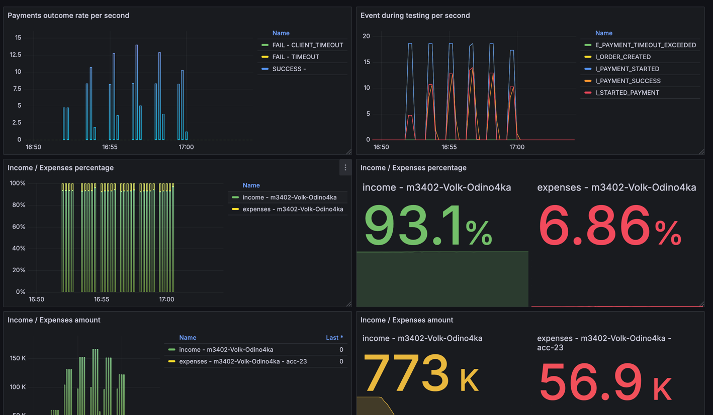
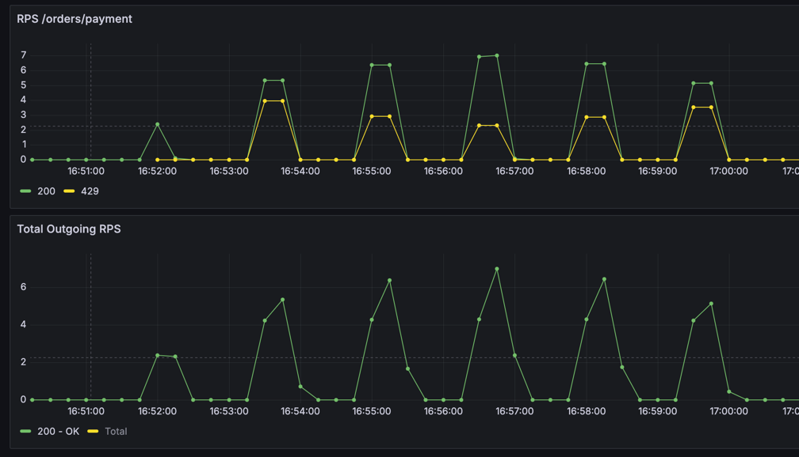
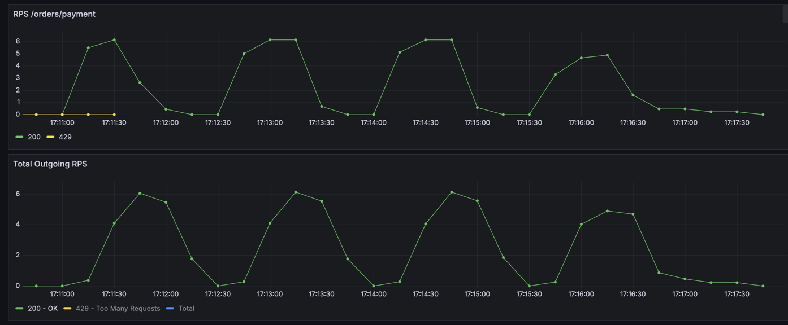
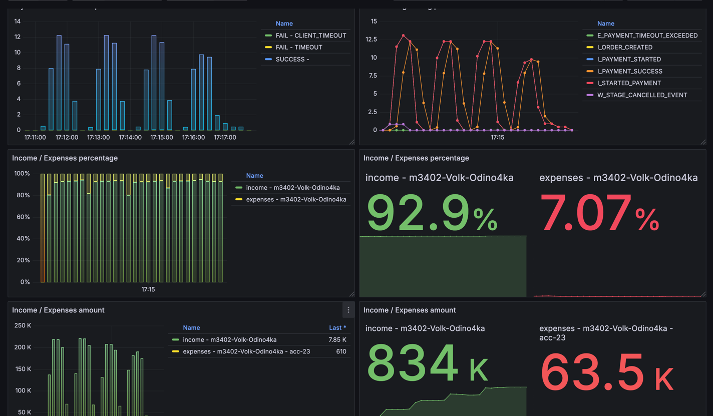

# Условия теста
```json
{
  "ratePerSecond": 3,
  "testCount": 1050,
  "processingTimeMillis": 26000,
  "runits": 90
}
```
---
```json
{
  "Аккаунт": "acc-23",
  "parallelRequests": 64, 
  "rateLimitPerSec": 11,
  "averageProcessingTime": "PT1S"
}
```

## Изначальные условия



## Решение
Изначально по графикам наблюдаю, что внешний rps очень неравномерный, есть моменты, когда он уходит в 0, а есть
места когда превышает 11 и приходится отбивать некоторые запросы с 429. (И время выполнения теста очень большое) 

Верным решением показалось заменить TokenBucketRateLimiter на 
LeakingBucketRateLimiter, чтобы выровнять трафик и сократить время исполнения теста

Размер бакета установил равный 275, из расчетов
```
(processingTime - averageProcessingTime) * rateLimitPerSec = (26 - 1) * 11 = 275
```

Получилось немного разгладить исходящий трафик и избавиться от 429 совсем



Также получилось сократить время выполнения теста до примерно 6 минут (с 17:11 до 17:17)


