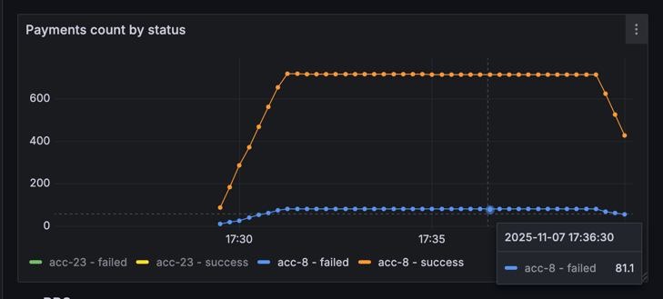
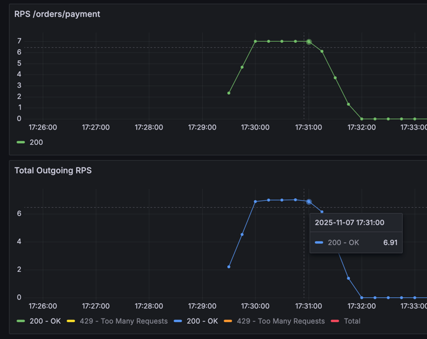
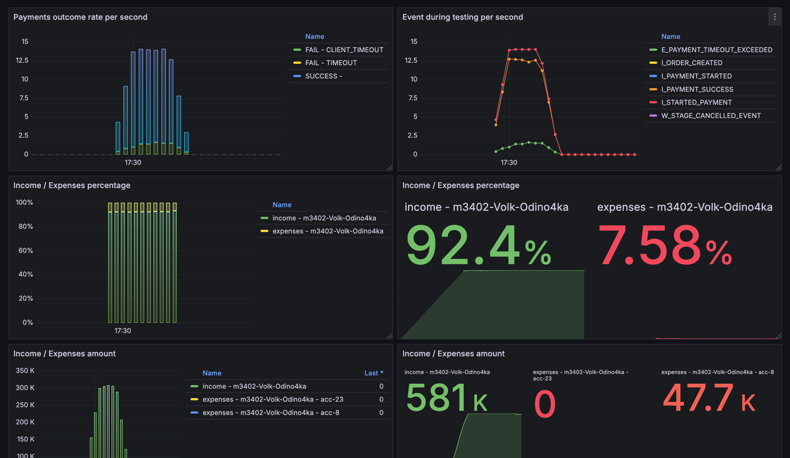
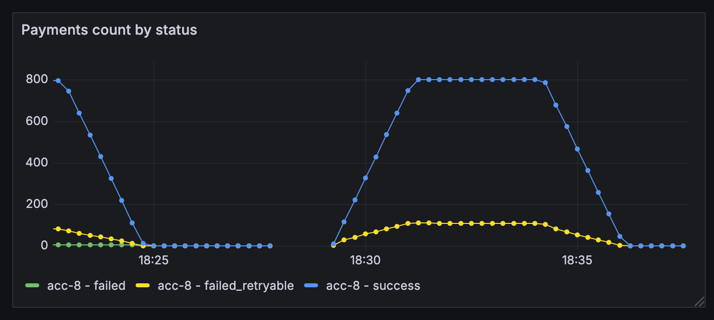
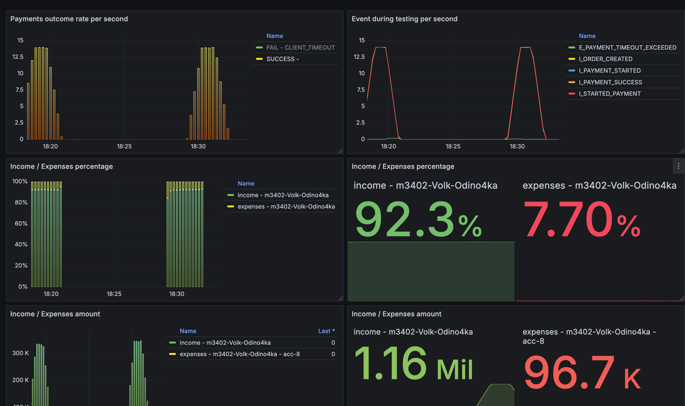

# Условия теста
```json
{
"ratePerSecond": 7,
"testCount": 800,
"processingTimeMillis": 3500
}
```
---
```json
{
  "Аккаунт": "acc-8",
  "parallelRequests": 50, 
  "rateLimitPerSec": 10,
  "averageProcessingTime": "PT0.7S"
}
```

## Изначальные условия и анализ



По графику платежей видно, что часть упала с причиной failed - то есть ошибка обращения к внешней системе, но в то
же время на графике HTTP вызовов видно, что все запросы к платежной системе выполнились успешно (200 - OK)

Значит, внешняя система присылает успешный ответ, в который заворачивает ошибку, после поиска по логам, оказалось, что
так и есть:
```
2025-11-07T17:31:08.343+03:00  INFO ... : [acc-8] Payment processed ... succeeded: false, message: Temporary error
```

## Решение
Добавим retry для успешных запросов, в которые завернуты ошибки

Решил сделать всего повторных попыток - 3, каждая из которых с delay = 100мс, 200мс, 300мс соответственно

В итоге ошибки пропали (Добавил в метрику статус для ошибок, которые будем ретраить)


Общая картина выглядит так
