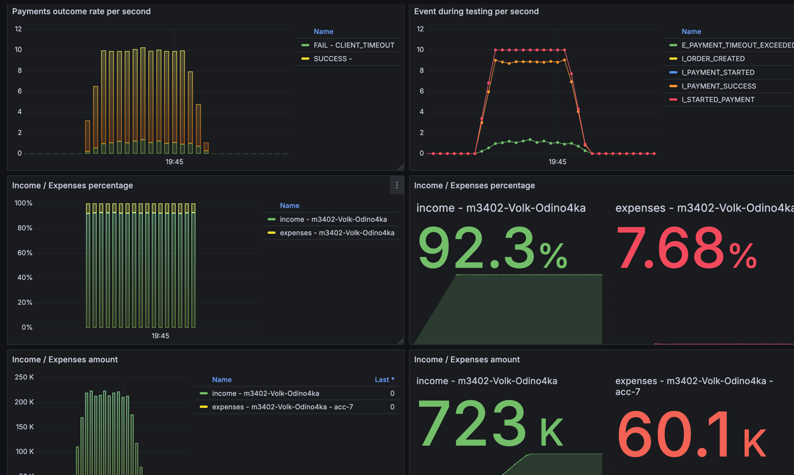
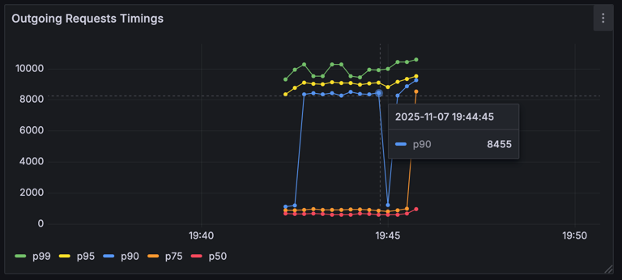
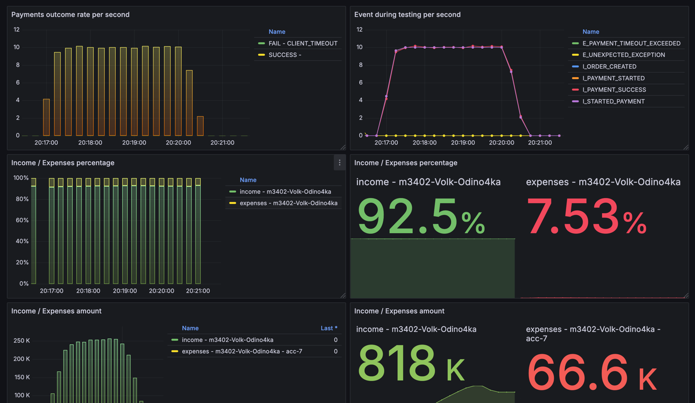
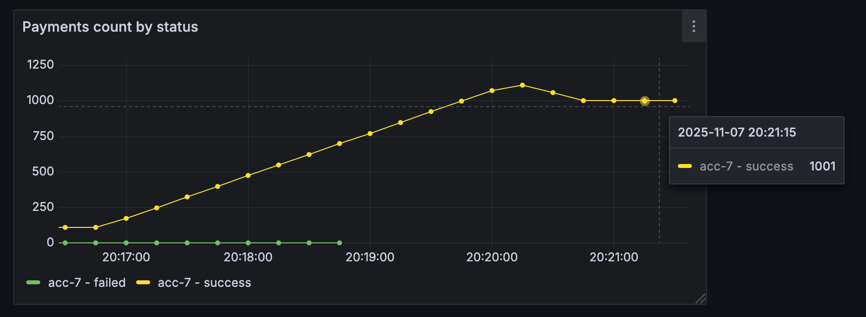

# Условия теста
```json
{
"ratePerSecond": 5,
"testCount": 1000,
"processingTimeMillis": 6000
}
```
---
```json
{
  "Аккаунт": "acc-7",
  "parallelRequests": 50, 
  "rateLimitPerSec": 8,
  "averageProcessingTime": "PT1.2S"
}
```

## Изначальные условия и анализ


Добавил график для подсчета продолжительности вызова


## Решение
По таймингам видно, что запросы с 90 квантиля выполняются очень долго. Поэтому попробовал ограничить таймауты на 1500мс



Как видим тайминги стали лучше + ретраи помогают, так как зафейленных платежей не было


Результаты выполнения близки к ожидаемым. Общее время исполнения тестов - примерно 4 минуты