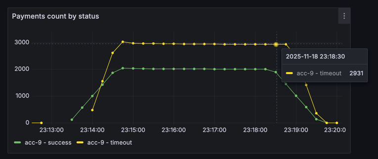
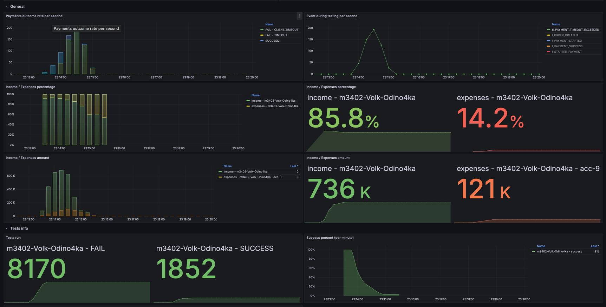
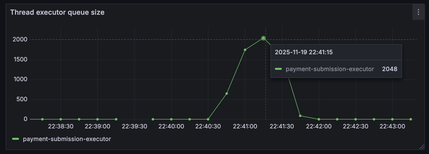
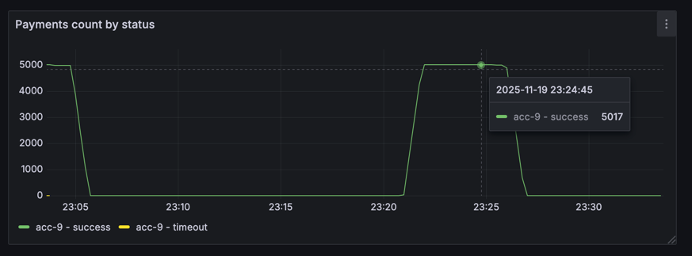
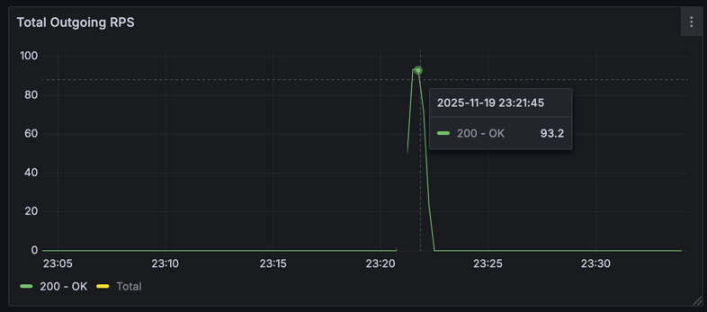
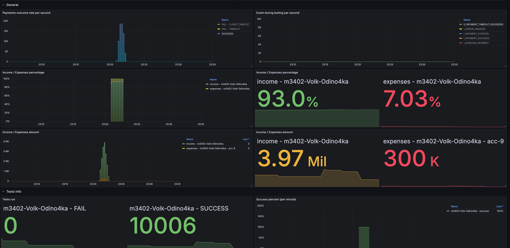

# Условия теста
```json
{
"ratePerSecond": 100,
"testCount": 5000,
"processingTimeMillis": 20000
}
```
---
```json
{
  "Аккаунт": "acc-9",
  "parallelRequests": 50, 
  "rateLimitPerSec": 120,
  "averageProcessingTime": "PT0.5S"
}
```

## Изначальные условия и анализ



Что происходит: к нам приходит очень много запросов (100rps), но обрабатывать на текущий момент мы можем только 32rps 
(Так как в ThreadPoolExecutor всего 16 потоков и averageProcessingTime = 0.5s, то получаем 32 запроса в секунду)

В то же время внешняя система может без проблем принимать 100rps (`parallelRequests / averageProcessingTime = 50 / 0.5 = 100`)

Все приходящие запросы мы помещаем в очередь в executor'e, когда до них доходит обработка, они уже ожидаемо падают по таймауту

## Решение
Повысил в ThreadPoolExecutor количество потоков до 50, после этого все тесты прошли успешно
> Пробовал повышать только maxPoolSize, но почему то это не принесло абсолютно никаких результатов

Все платежи завершились успехом


исходящий RPS достигал 100


Общие результаты


