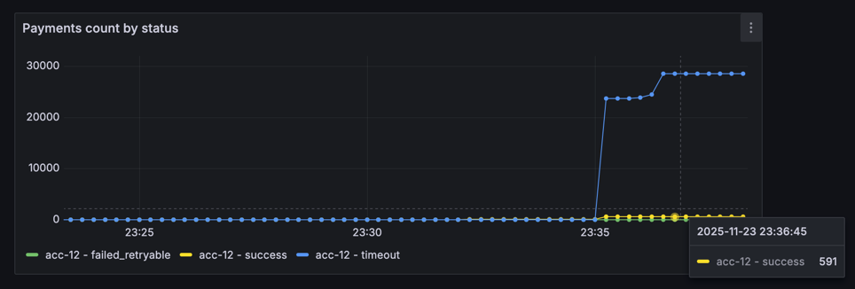
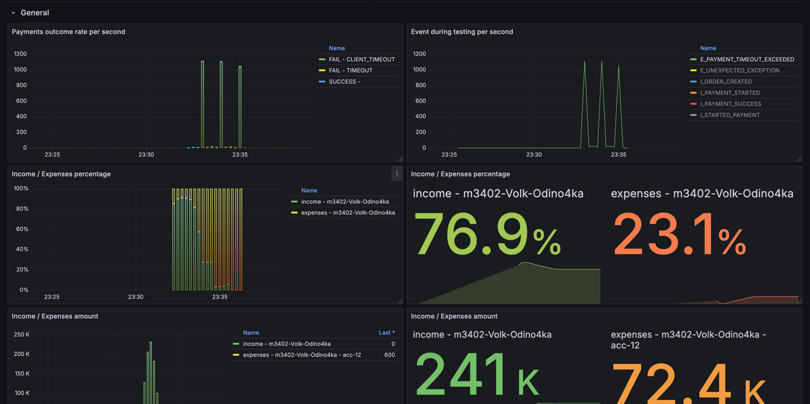
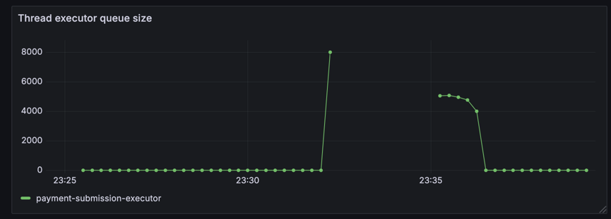
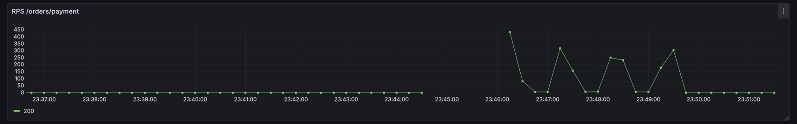
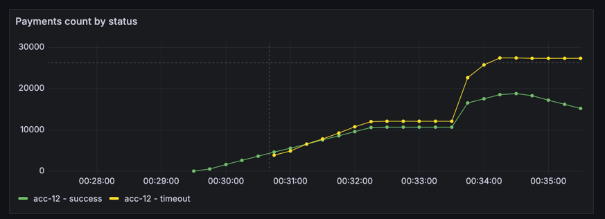
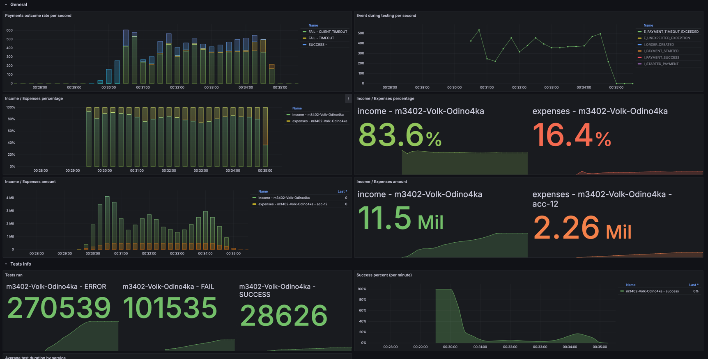
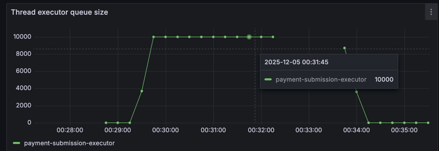

# Условия теста
```json
{
"ratePerSecond": 1000,
"testCount": 200000,
"processingTimeMillis": 50000
}
```
---
```json
{
  "Аккаунт": "acc-12",
  "parallelRequests": 20000, 
  "rateLimitPerSec": 1100,
  "averageProcessingTime": "PT10S"
}
```

## Изначальные условия и анализ




Из графиков видно, что трафик приходит периодически накатами (и причем очень большими) - в один 
момент времени приходит большое число запросов, которые начинают позже разгребаться

Внешняя система может держать `parallelRequests / averageProcessingTime = 20000 / 10 = 2000rps`, но в executor'e в
текущий момент всего 50 поток, то есть мы можем давать всего 5rps.

Повышать число потоков можно, но без фанатизма - тк 1 поток == примерно 1МБ (Оперативной памяти не напасешься). В таком
случае кажется верным решением посмотреть в сторону корутин (легковесных потоков), так как они намного дешевле обычных

\+ К тому же OkHttp по умолчанию использует HTTP/1 в запросах без TLS, то есть получаем HOL

## Решение
Пробую перейти на использование корутин, так чтобы каждый платеж выполнялся в отдельной корутине



Ситуация стала явно лучше, теперь хотя бы половина платежей не падает по таймауту, но все еще видно, что
очередь используется целиком, и много запросов долго ждут, значит можно попробовать использовать HTTP/2 
с мультиплексированием


